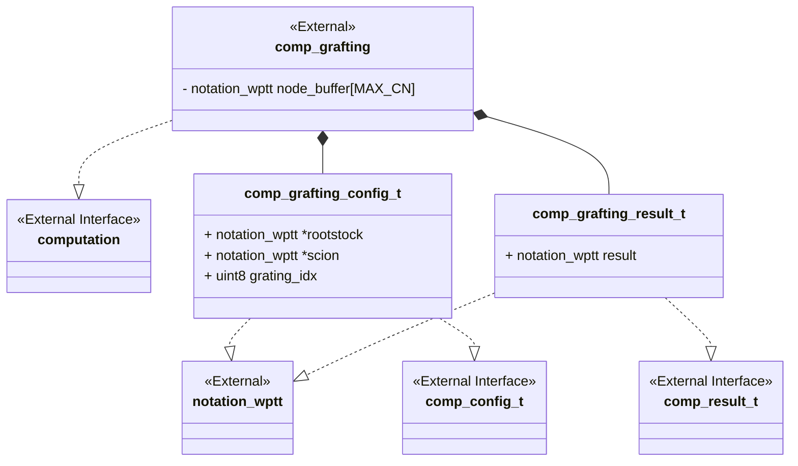
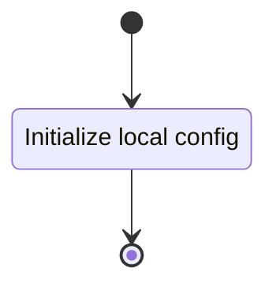
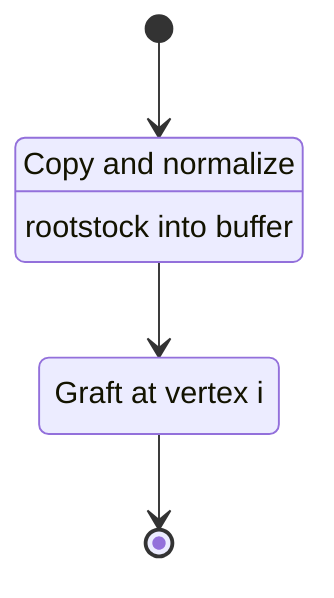
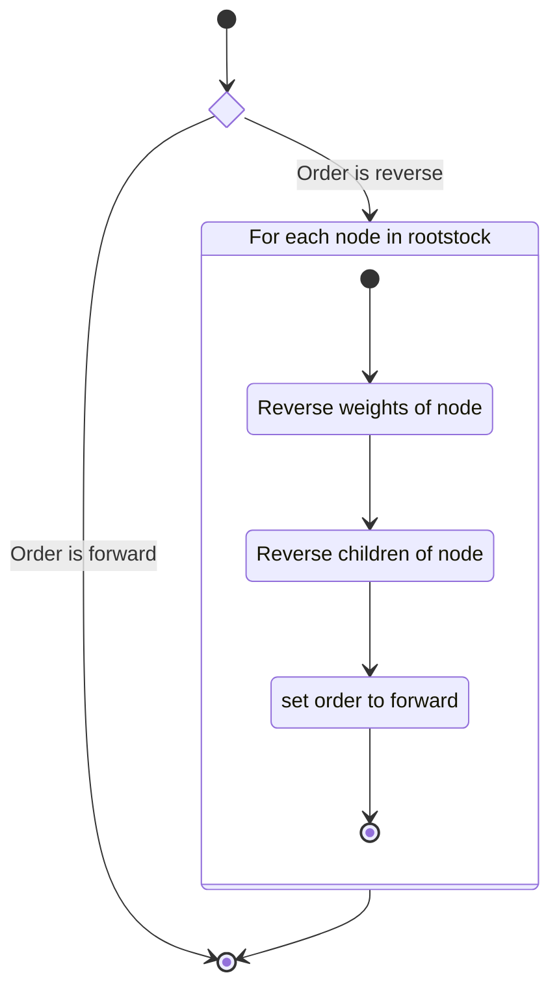
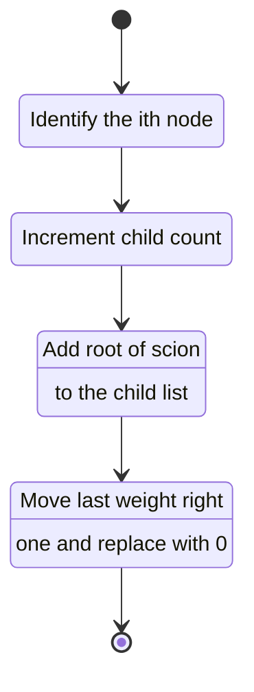

<!-- prettier-ignore-start -->
(sec-computation-grafting)=
### Arborescent Tangle Grafting Computation
<!-- prettier-ignore-end -->

The arborescent tangle grafting computation implements a portion of the
theoretical use case seen in @sec-arborescent. Particularly, the grafting
operation defined in @rli-gen-def-grafting_op-wpt.

#### Class Diagram



#### Language

C

#### Implements

-   Computation Interface (@sec-interfaces-computation)

#### Uses

-   Notation Weighted Planar Tangle Tree (@sec-library-wptt-note)

#### Libraries

N/A

#### Functionality

##### Public Structures

###### Config Structure

The config structure contains the data needed for computing the grafting of two
input arborescent tangles.

This includes:

-   Rootstock pointer to a read-only notation structure for a WPTT.
-   Scion pointer to a read-only notation structure for a WPTT.

###### Result Structure

The config structure contains a weighted planar tangle tree that is the result
of grafting the configured rootstock to the configured scion.

##### Public Functions

###### Config Function

The config function configures the local instance variable of the computation.

This process is described in the following state machines:



###### Compute Function

The compute function carries out the arborescent tangle grafting computation.
The function may contain sub machines that can be broken out into functions in
the implementation.

This process is described in the following state machines:



###### Result Function

When this function is invoked, the result of the neutrality computation process
is reported.

##### Private Functions

##### Normalize Rootstock

The normalize rootstock function rearranges the nodes of the rootstock so that
each node has forwarded order. This is accomplished by reversing the child and
weight list, then setting the order to forward in every node that has order
reverse.



###### Graft Scion to Rootstock

This function carries out the



#### Validation

##### Config Function

###### Positive Tests

```{test-card} Valid Config

A valid config for the computation is passed to the function.

**Inputs:**

- A valid config.

**Expected Output:**

A positive response.

```

###### Negative Tests

```{test-card} Null Config

A null config for the computation is passed to the function.

**Inputs:**

- A null config.

**Expected Output:**

A negative response.

```

```{test-card} Null Config Parameters

A config with various null parameters is passed to the function.

**Inputs:**

- A config with null rootstock.
- A config with null ith value of rootstock.
- A config with rootstock that an insufficient number of nodes.
- A config with null scion.
- A config with null root scion.

**Expected Output:**

A negative response.

```

##### Compute Function

###### Positive Tests

```{test-card} A valid config

A valid config is set for the component. The computation is executed and
returns successfully. The result written to the write interface is correct.

**Inputs:**

- A valid config is set.

**Expected Output:**

- A positive response.
- A correct output on the write interface.

```

```{test-card} A valid config with null write interface

A valid config is set for the component with null write. The computation is
executed and returns successfully.

**Inputs:**

- A valid config is set.

**Expected Output:**

- A positive response.

```

###### Negative Tests

```{test-card} Not Configured

The compute interface is called before configuration.

**Inputs:**

- None.

**Expected Output:**

A negative response.

```

##### Result Function

###### Positive Tests

```{test-card} A valid config and computation

A valid config is set for the component. The computation is executed and
returns successfully. The resulting value is correct when read from the result
interface.

**Inputs:**

- A valid config is set.

**Expected Output:**

- A positve response.
- The result is correct.
```

###### Negative Tests

```{test-card} Computation not executed

The result interface is called before compute has been run.

**Inputs:**

- None.

**Expected Output:**

A negative response.

```
