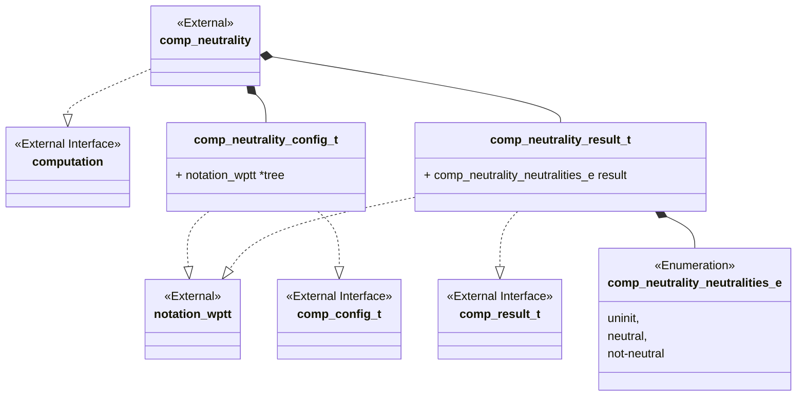
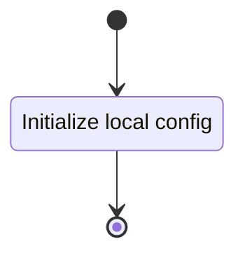
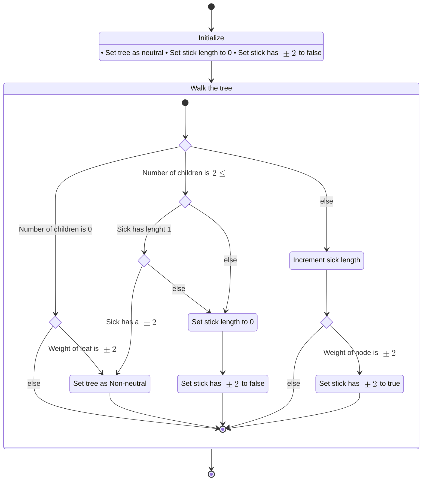

<!-- prettier-ignore-start -->
(sec-computation-neutrality)=
### Arborescent Tangle Neutrality Computation
<!-- prettier-ignore-end -->

The arborescent tangle neutrality computation implements a portion of the
theoretical use case seen in @sec-RLITT-generation. Particularly, the neutrality
operation defined in @rli-gen-sec-pm-con.

#### Class Diagram



#### Language

C

#### Implements

-   Computation Interface (@sec-interfaces-computation)

#### Uses

-   Notation Weighted Planar Tangle Tree (@sec-library-wptt-note)

#### Libraries

N/A

#### Functionality

##### Public Structures

###### Config Structure

The config structure contains the data needed for computing the neutrality of an
input arborescent tangle.

This includes:

-   A pointer to a read-only notation structure for a WPTT.

###### Result Structure

The config structure contains the enumerated value of the neutrality of the
input tree.

##### Public Functions

###### Config Function

The config function configures the local instance variable of the computation.

This process is described in the following state machines:



###### Compute Function

The compute function carries out the arborescent tangle neutrality computation.
The function may contain sub machines that can be broken out into functions in
the implementation. The walk the tree function should be implmented with a
stack-based iteration.

This process is described in the following state machines:



###### Result Function

When this function is invoked, the result of the neutrality computation process
is reported.

#### Validation

##### Config Function

###### Positive Tests

```{test-card} Valid Config

A valid config for the computation is passed to the function.

**Inputs:**

- A valid config.

**Expected Output:**

A positive response.

```

###### Negative Tests

```{test-card} Null Config

A null config for the computation is passed to the function.

**Inputs:**

- A null config.

**Expected Output:**

A negative response.

```

```{test-card} Null Config Parameters

A config with various null parameters is passed to the function.

**Inputs:**

- A config with null tree.

**Expected Output:**

A negative response.

```

##### Compute Function

###### Positive Tests

```{test-card} A valid config

A valid config is set for the component. The computation is executed and
returns successfully. The result written to the write interface is correct.

**Inputs:**

- A valid config is set.

**Expected Output:**

- A positive response.
- A correct output on the write interface.

```

```{test-card} A valid config with null write interface

A valid config is set for the component with null write. The computation is
executed and returns successfully.

**Inputs:**

- A valid config is set.

**Expected Output:**

- A positive response.

```

###### Negative Tests

```{test-card} Not Configured

The compute interface is called before configuration.

**Inputs:**

- None.

**Expected Output:**

A negative response.

```

##### Result Function

###### Positive Tests

```{test-card} A valid config and computation

A valid config is set for the component. The computation is executed and
returns successfully. The resulting value is correct when read from the result
interface.

**Inputs:**

- A valid config is set.

**Expected Output:**

- A positve response.
- The result is correct.
```

###### Negative Tests

```{test-card} Computation not executed

The result interface is called before compute has been run.

**Inputs:**

- None.

**Expected Output:**

A negative response.

```
