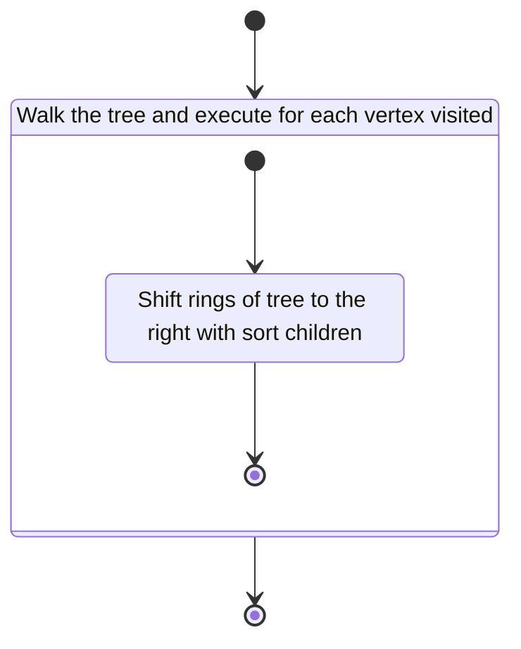

<!-- prettier-ignore-start -->
(sec-computation-shift)=
### Arborescent Tangle Ring Shift Computation
<!-- prettier-ignore-end -->

The arborescent tangle ring shift computation implements a portion of the
theoretical use case seen in @sec-rlitt-generation. Particularly, the ring shift
operation is defined in @rli-gen-sec-pm-con.

#### Class Diagram

$\,$

````{figure}
```{mermaid}
classDiagram
    comp_ring shift --|> computation
    comp_rlitt_ringshift_config_t --|> notation_wptt
    comp_rlitt_ringshift_config_t --|> comp_config_t
    comp_ring shift *-- comp_rlitt_ringshift_config_t
    comp_rlitt_ringshift_result_t --|> notation_wptt
    comp_rlitt_ringshift_result_t --|> comp_result_t
    comp_ring shift *-- comp_rlitt_ringshift_result_t

    class computation {
        <<interface>>
    }

    class comp_ring shift {
<<External >>
}

class notation_wptt{
<<>>
}

class comp_rlitt_ringshift_config_t {
<<struct>>
+ notation_wptt *wptt
}

class comp_config_t {
<<interface>>
}

class comp_rlitt_ringshift_result_t {
<<struct>>
+ notation_wptt *result
}

class comp_result_t {
<<interface>>
}


```
````

#### Language

C

#### Implements

- Computation Interface (@sec-interfaces-computation)

#### Uses

- Notation Weighted Planar Tangle Tree (@sec-library-wptt-note)

#### Libraries

N/A

#### Functionality

##### Public Structures

###### Configuration Structure

The configuration structure contains the data needed for computing the tree with
$R^\pm$ applied.

This includes:

- A pointer to a notation structure for a WPTT.

###### Result Structure

The result structure contains a weighted planar tangle tree that is the result
of application of the $R^\pm$ moves to the configured tree.

### Public Functions

###### Configuration Function

The configuration function configures the local instance variable of the
computation.

This process is described in the following state machines:

````{figure}
```{mermaid}
stateDiagram-v2
  state "Initialize local config" as Sc

    [*] --> Sc
    Sc --> [*]

```
````

#### Compute Function

The compute function carries out the arborescent tangle ring shift operation.
The function may contain sub machines that can be broken out into functions in
the implementation.

This process is described in the following state machines:

````{figure}

````

#### Result Function

When this function is invoked, the result of the ring shift computation process
is reported.

### Private Functions

#### Sort Children

The sort children function uses the C standard qsort function to sort the
children of the object vertex.

###### Result Function

When this function is invoked, the result of the ring shift computation process
is reported.

#### Validation

##### Configuration Function

###### Positive Tests

```{test-card} Valid Configuration

A valid configuration for the computation is passed to the function.

**Inputs:**

- A valid configuration.

**Expected Output:**

A positive response.

```

###### Negative Tests

```{test-card} Null Configuration

A null configuration for the computation is passed to the function.

**Inputs:**

- A null configuration.

**Expected Output:**

A negative response.

```

```{test-card} Null Configuration Parameters

A configuration with various null parameters is passed to the function.

**Inputs:**

- A configuration with null rootstock.
- A configuration with null scion.

**Expected Output:**

A negative response.

```

##### Compute Function

###### Positive Tests

```{test-card} A valid Configuration

A valid configuration is set for the component. The computation is executed and
returns successfully. The result written to the write interface is correct.

**Inputs:**

- A valid configuration is set with following:
    - `i([8](([2][2]1)5)[8]([2][2]1)[8]([2][2]1)[8]([2][2]1)[8]([2][2]1))`

**Expected Output:**

- A positive response.
- A correct output on the write interface.

```

```{test-card} A valid configuration with null write interface

A valid configuration is set for the component with null write. The computation is
executed and returns successfully.

**Inputs:**

- A valid configuration is set.

**Expected Output:**

- A positive response.

```

###### Negative Tests

```{test-card} Not Configured

The compute interface is called before configuration.

**Inputs:**

- None.

**Expected Output:**

A negative response.

```

##### Result Function

###### Positive Tests

```{test-card} A valid configuration and computation

A valid configuration is set for the component. The computation is executed and
returns successfully. The resulting value is correct when read from the result
interface.

**Inputs:**

- A valid configuration is set.

**Expected Output:**

- A positive response.
- The result is correct.
```

#### Negative Tests

```{test-card} Computation not executed

The result interface is called before compute has been run.

**Inputs:**

- None.

**Expected Output:**

A negative response.

```

```

```
