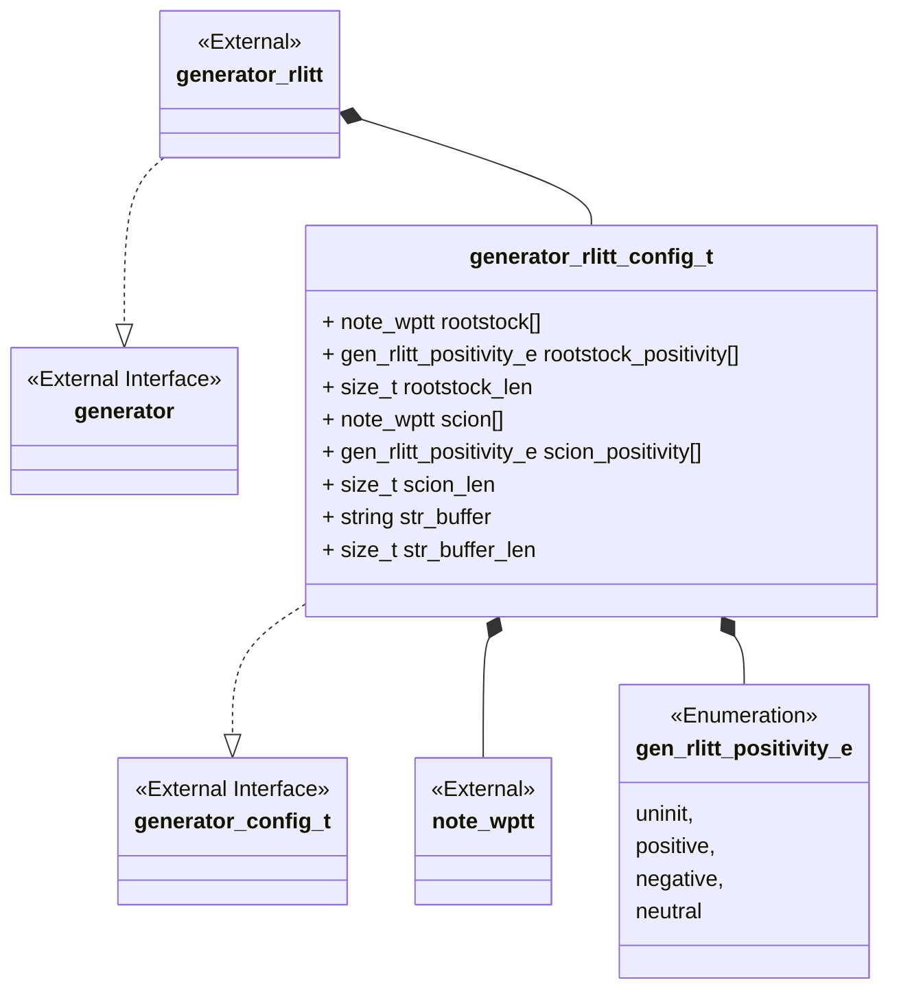
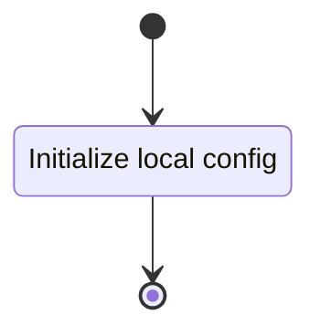
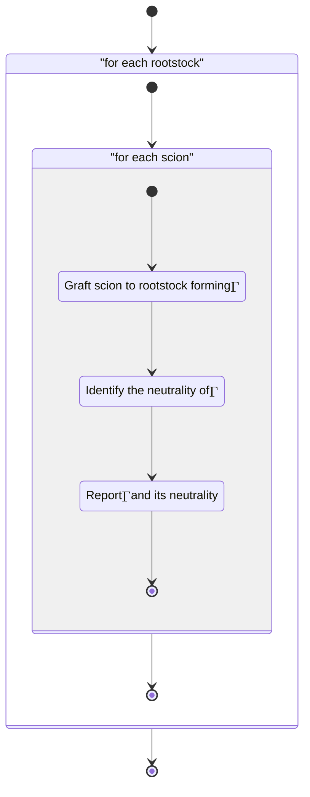

<!-- prettier-ignore-start -->
(sec-rlitt_tang_gen)=
### Right Leaning Identity Tangle Tree Generator
<!-- prettier-ignore-end -->

The arborescent tangle generator implements a portion of the theoretical use
case seen in @sec-arborescent.

#### Class Diagram



#### Language

C

#### Implements

-   Generator Interface (@sec-interfaces-generator)

#### Uses

-   Notation arborescent weighted planar tangle tree (@sec-library-wptt-note)

#### Libraries

N/A

#### Functionality

##### Public Structures

###### Arborescent Generator Config Structure

The config structure contains the data needed for generating a set of
arborescent tangles from a collection of arborescent rootstock and collection of
arborescent good scions.

This includes:

-   A notation structure for an WPTT.
-   A pointer to a multidimensional array of twist vectors.
-   A string buffer for holding the stringified algebraic tangle tree.

##### Public Functions

###### Config Function

The config function configures the local instance variable of the generator.

This process is described in the following state machines:



###### Generate Function

The generation function carries out the Arborescent tangle generation until the
inputs are exhausted. The grafting operation is carried out by a call to the
computation grafting component (@sec-computation-grafting) and the neutrality
determination is carried out by the neutrality computation component
(@sec-computation-neutrality).

This process is described in the following state machines:



#### Validation

##### Config Function

###### Positive Tests

```{test-card} Valid Config

A valid config for the generator is passed to the function.

**Inputs:**

- A valid config.

**Expected Output:**

A positive response.

```

###### Negative Tests

```{test-card} Null Config

A null config for the generator is passed to the function.

**Inputs:**

- A null config.

**Expected Output:**

A negative response.

```

```{test-card} Null Config Parameters

A config with various null parameters is passed to the function.

**Inputs:**

- A config with null rootstock.
- A config with null rootstock_positivity.
- A config with 0 rootstock_len.
- A config with null scion.
- A config with null scion_positivity.
- A config with 0 scion_len.
- A config with null str_buffer.
- A config with 0 str_buffer_len.

**Expected Output:**

A negative response.

```

##### Generate Function

###### Positive Tests

```{test-card} Valid Config and generation

A valid config is set and the generation is called.

**Inputs:**

- The rootstock list
    - $\iota\LB 1\RB$
    - $\iota\LP\LB2\RB \LB3\RB 4\RP$
- The scion list
    - $\iota\LB 5\RB$
    - $\iota\LP\LB6\RB \LB7\RB 8\RP$

**Expected Output:**

The algebraic tangle trees:
-  $\iota\LB5\ 1\RB$
-  $\iota\LP\LP\LB 6\RB\LB 7\RB 8\RP 1\RP$
-  $\iota\LP\LB2\RB\LB3\RB\LB5\RB 4\RP$
-  $\iota\LP\LB2\RB\LB3\RB\LP\LB6\RB\LB7\RB8\RP4\RP$

```

###### Negative Tests

```{test-card} Not Configured

The generate interface is called before configuration.

**Inputs:**

- None.

**Expected Output:**

A negative response.

```
