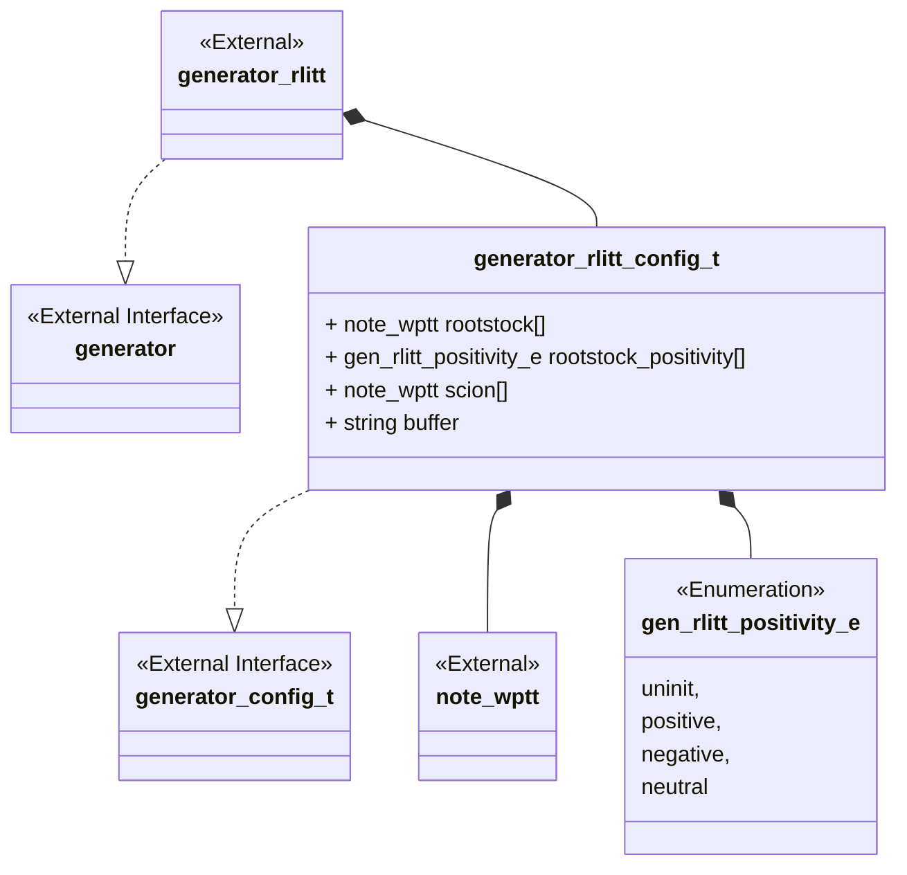
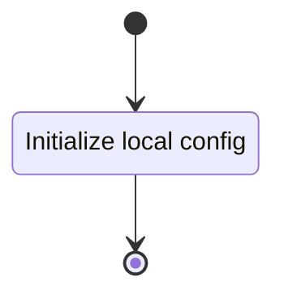
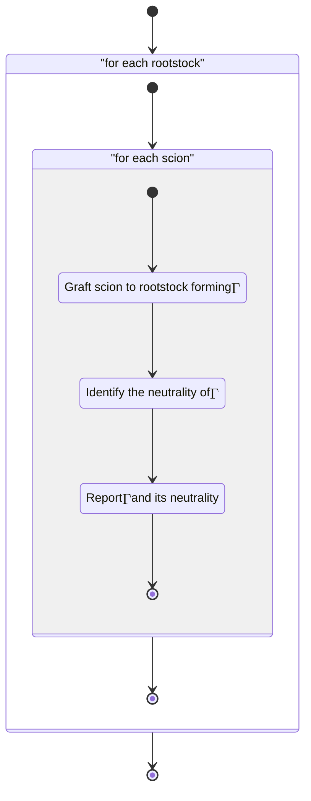

### Arborescent Tangle Generator

The arborescent tangle generator implements a portion of the theoretical use
case seen in @sec-arborescent.

#### Class Diagram



#### Language

C

#### Implements

-   Generator Interface (@sec-interfaces-generator)

#### Uses

-   Notation arborescent weighted planar tangle tree (@sec-library-wptt-note)

#### Libraries

N/A

#### Functionality

##### Public Structures

###### Arborescent Generator Config Structure

The config structure contains the data needed for generating a set of
arborescent tangles from a collection of arborescent rootstock and collection of
arborescent good scions.

This includes:

-   A notation structure for an WPTT.
-   A pointer to a multidimensional array of twist vectors.
-   A string buffer for holding the stringified algebraic tangle tree.

##### Public Functions

###### Config Function

The config function configures the local instance variable of the generator.

This process is described in the following state machines:



###### Generate Function

The generation function carries out the Arborescent tangle generation until the
inputs are exhausted. The grafting operation is carried out by a call to the
computation grafting component (@sec-computation-grafting) and the neutrality
determination is carried out by the neutrality computation component
(@sec-computation-neutrality).

This process is described in the following state machines:



##### Private Functions

###### Identify the neutrality of $$\Gamma$$

#### Validation

##### Config Function

###### Positive Tests

```{test-card} Valid Config

A valid config for the generator is passed to the function.

**Inputs:**

- A valid config.

**Expected Output:**

A positive response.

```

###### Negative Tests

```{test-card} Null Config

A null config for the generator is passed to the function.

**Inputs:**

- A null config.

**Expected Output:**

A negative response.

```

##### Generate Function

```{test-card} Valid Config and generation

A valid config is set and the generation is called.

**Inputs:**

- The twist vector lists
    1. $\,$
        - [ 0 1 1 ]
        - [ 0 2 2 ]
        - [ 0 3 3 ]
    2. $\,$
        - [ 1 1 1 ]
        - [ 1 2 2 ]
    3. $\,$
        - [ 2 1 1 ]
        - [ 2 2 2 ]
        - [ 2 3 3 ]
        - [ 2 4 4 ]

**Expected Output:**

The algebraic tangle trees:
-  +[1 1 0]+[1 1 1][1 1 2]
-  +[1 1 0]+[1 1 1][2 2 2]
-  +[1 1 0]+[1 1 1][3 3 2]
-  +[1 1 0]+[1 1 1][4 4 2]
-  +[1 1 0]+[2 2 1][1 1 2]
-  +[1 1 0]+[2 2 1][2 2 2]
-  +[1 1 0]+[2 2 1][3 3 2]
-  +[1 1 0]+[2 2 1][4 4 2]
-  +[2 2 0]+[1 1 1][1 1 2]
-  +[2 2 0]+[1 1 1][2 2 2]
-  +[2 2 0]+[1 1 1][3 3 2]
-  +[2 2 0]+[1 1 1][4 4 2]
-  +[2 2 0]+[2 2 1][1 1 2]
-  +[2 2 0]+[2 2 1][2 2 2]
-  +[2 2 0]+[2 2 1][3 3 2]
-  +[2 2 0]+[2 2 1][4 4 2]
-  +[3 3 0]+[1 1 1][1 1 2]
-  +[3 3 0]+[1 1 1][2 2 2]
-  +[3 3 0]+[1 1 1][3 3 2]
-  +[3 3 0]+[1 1 1][4 4 2]
-  +[3 3 0]+[2 2 1][1 1 2]
-  +[3 3 0]+[2 2 1][2 2 2]
-  +[3 3 0]+[2 2 1][3 3 2]
-  +[3 3 0]+[2 2 1][4 4 2]

```
