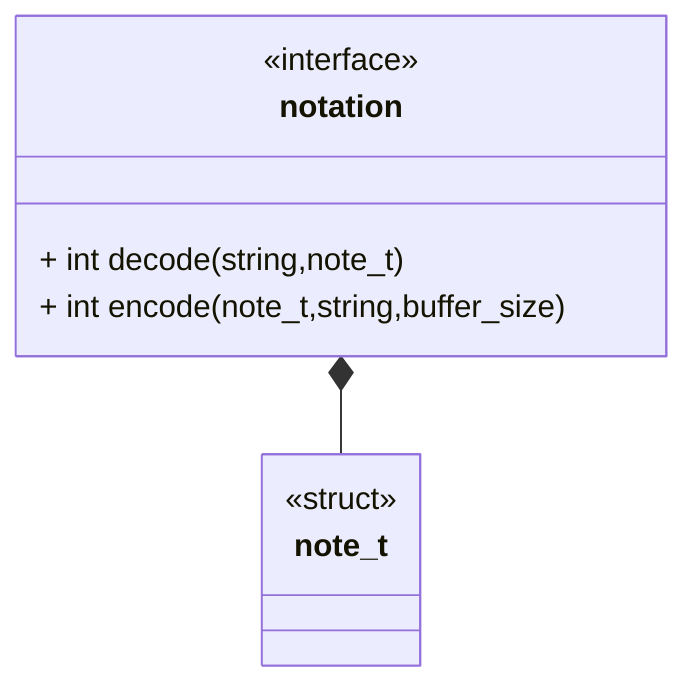

<!-- prettier-ignore-start -->
(sec-interfaces-notation)=
### Notation Interface
<!-- prettier-ignore-end -->

The notation interface defines the general form for a component used to store
knot notational data. This includes a computational data structure for a knot
notation and the functions required for translation into and out of string
representations of that notation.

#### Class Diagram

#### Functionality

##### Public Structures

###### Notation Data Structure

This is the primary data structure for a notation component. This data structure
defines and stores the computational representation of a knot notation.

##### Public Functions

###### Encode Function

The encode function takes in the string representation of a knot notation,
processes the string and stores the computational representation into a notation
data structure.

###### Decode Function

The decode function takes in a computational representation of a notation data
structure, and processes it into a string representation of a knot notation.
