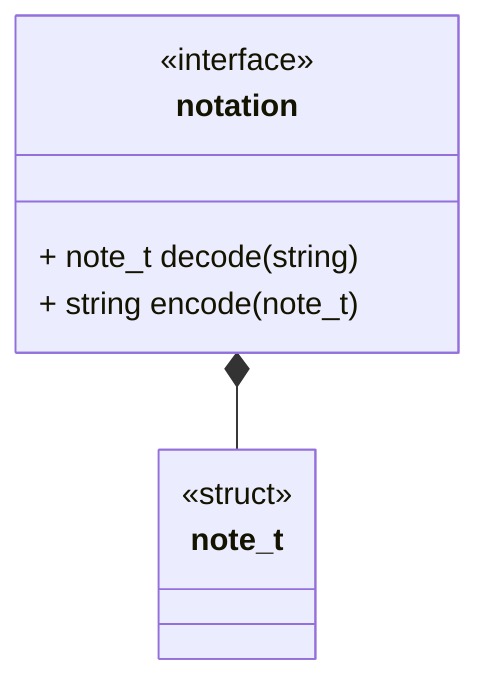

<!-- prettier-ignore-start -->
(sec-interfaces-notation)=
##### Notation Interface
<!-- prettier-ignore-end -->

###### Brief

This interface describes a generic notation module. A notation module sits
between a storage module and an upper layer (Computation, Generator, etc.). The
notation module will define a struct that encodes the notational data and two IO
functions.

The encode/decode operations are taken from the perspective of the database.

**Encoding**

Takes a data structure and encodes it as its string representation.

**Decoding**

Takes a string and decodes it as its data structure representation.
