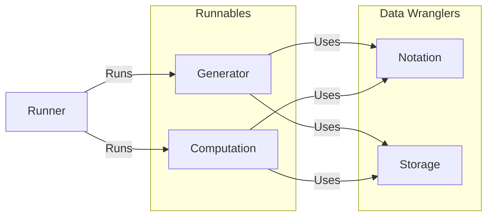

# Architecture Of A Knot Theory Toolbox


```mermaid
flowchart LR
    Runner
    subgraph "Runnables"
        Generator
        Computation
    end
    subgraph "Data Wranglers"
        Notation
        Storage
    end
    Runner -->|Runs| Generator
    Runner -->|Runs| Computation
    Generator -->|Uses| Notation
    Computation -->|Uses| Notation
    Generator -->|Uses| Storage
    Computation -->|Uses| Storage


```

```{include} ./documentation/interfaces/interfaces.md

```

```{include} ./documentation/core_libraries.md

```
