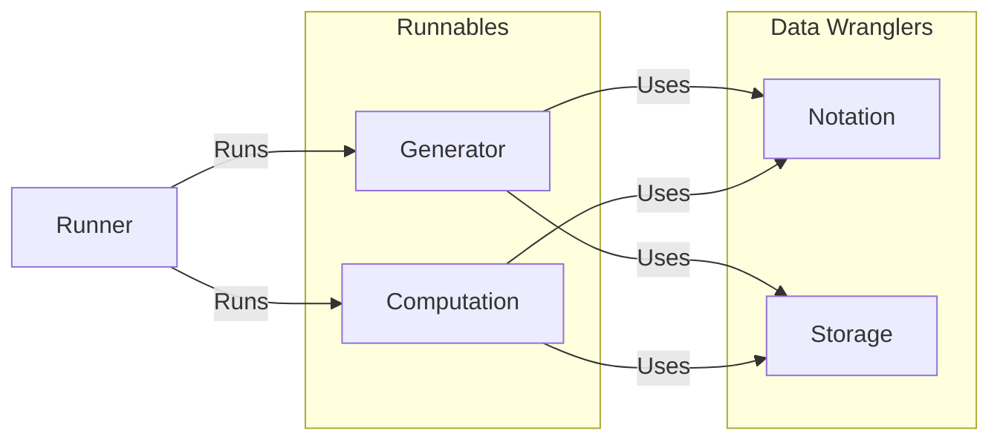

We now shift from the mathematical world to the world of computers and software.
We start with a brief overview of product management and software engineering.
The overview includes the definitions of concepts and terms needed for modeling
of a software process to be paired with the knot theory software toolbox. With
the design goal of use in professional and undergraduate research projects.
Next, we summarize what features we should look for in knot theory software and
give an architectural design against those features for a general Knot Theory
Software Toolbox. Finally, using this architecture, we present documentation for
how the tabulation theory of @ch-tabulation is translated to software.

```{include} ./basics.md

```

# Features Of A Knot Theory Software Toolbox

In this section, we explore what the strength and weaknesses of knot theoretic
computational tools that exist. Taking this information, we formulate what
features our knot theory software toolbox must have. Finally, we outline the
software documentation for the components used, described in @ch-tabulation.

## Prior Work

### KnotPlot [@schareinInteractiveTopologicalDrawing1998]

### KnotTheory [@schareinInteractiveTopologicalDrawing1998](Mathematica https://katlas.org/wiki/Printable_Manual)

### LinKnot [@bar-natanKnotTheory] (Mathematica library https://www.mi.sanu.ac.rs/vismath/linknot/index.html)

### SnapPea/SnapPy [@SnapPy](https://github.com/3-manifolds/SnapPy)



## Unit Designs

```{include} ./documentation/interfaces/interfaces.md

```

```{include} ./documentation/core_libraries.md

```
