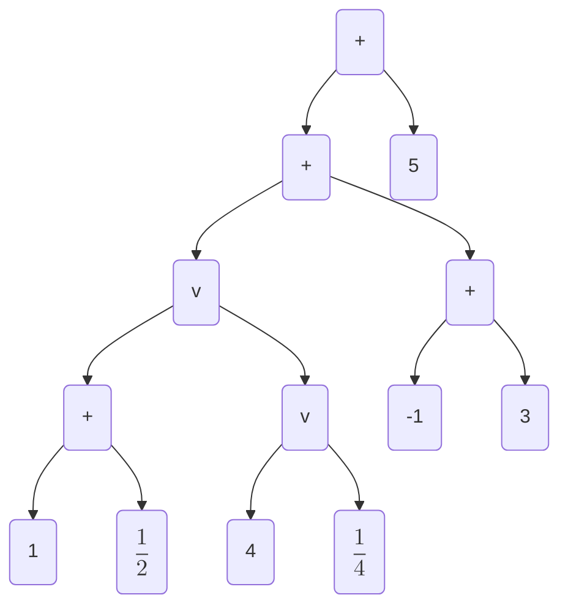

<!-- prettier-ignore-start -->
(sec-monttang)=
### Montesinos Tangles
<!-- prettier-ignore-end -->

In this section, we will use rational tangles to build a yet more complex class
of tangles, the Montesinos tangles. This building up process demonstrates the
core strategy of tangle tabulation.

#### Construction

With the rational tangles in hand, we wish to utilize that data to enumerate
additional tangles. One way we have seen to build simple objects into complex
objects is to combine two tangles with the $+$ or $\vee$ operation. To keep
complexity under control, we start with combining tangles only with repeated $+$
sum. When the summands $R_i$ (@mont-math-def), are all rational or integral, we
call the result of the sum a **Montesinos Tangle**.

```{math}
:label: mont-math-def

R_0+R_1+\cdots+R_n

```

```{note}
Under this characterization of the Montesinos tangles, every rational tangle is
also a Montesinos tangle.
```

##### Unique Representative

Next, we will describe a unique representative for a Montesinos tangle, allowing
us to tell two Montesinos tangles apart. For each rational or integral summand
$R_i$ in a Montesinos tangle, we have four possibilities:

1. $R_i$'s canonical twist vector is positive and ends in $0$
2. $R_i$'s canonical twist vector is positive and does not end in $0$
3. $R_i$'s canonical twist vector is negative and ends in $0$
4. $R_i$'s canonical twist vector is negative and does not end in $0$

Observe that in the second and fourth cases, $R_i$ terminates in a horizontal
integral tangle. In these cases, the tangle can be simplified by using the flype
(@subsubsec-opo-flype) to move the horizontal crossings to be the right most
summand, seen in @mont-ex-flypesimple. When this process is carried out for each
summand of the type in case two and four, the resulting summands all fall into
cases one and three.

````{prf:example}
:label: mont-ex-flypesimple
```{figure} ../../media/fig-mont.svg
```
A Montesinos tangle $\LB1\ 3\ 2\RB+\LB 3\ 0\RB+\LB \m1\ \m3\ \m2\RB+\LB 3\ 0\RB+\LB1\ 3\ 2\RB$
simplifying to $\LB 3\ 0\RB+\LB 3\ 0\RB+\LB \m3\ \m 2\ 0\RB+\LB 3\ 0\RB+\LB 3\ 0\RB+\LB 3\RB$
````

We will now pair down to a single possibility, case one. Consider a summand
$R_i$ in case three, meaning $\m 1 <F\LP R_i\RP<0$. @rational-thm-conways tells
us that if we can find an alternative, potentially non-canonical, twist vector
that fits our needs, we are free to exchange without impacting topology. What we
would like, is an odd length twist vector where every entry is positive, except
for the right most which is a negative value. This ensures that the fraction is
still negative but will allow us to flype the terminal horizontal integral
tangle to the right. Rockett and Szüsz give a lemma that establishes the
existence of such a twist vector for each rational number.

```{prf:lemma} [@rockettContinuedFractions1998]
:label: mont-lem-other_cfrac
Every rational number has a continued fraction with positive integer entries
except for the first (rightmost twist vector entry) which is an integer.
```

We are now left with only the first case, and can define a canonical form for
Montesinos tangles.

````{prf:definition}Canonical Montesinos Tangles[@ernstTANGLEEQUATIONS1996; @bonahonNewGeometricSplittings2016]

Every non-rational Montesinos tangle $T$ admits a canonical diagram satisfying
the following construction:
```{math}
T \cong R_0+\cdots+R_m+\frac{k}{1}
```
where each $R_i \cong \frac{p_i}{q_i}$ is a rational subtangle in canonical form with
fraction satisfying $0<\frac{p_i}{q_i}<1$, and $\frac{k}{1}$ is a horizontal
integer subtangle.
````

#### Computational Methods

##### Notation

Before we can generate Montesinos tangles, we need to define an efficient
notation for computation and storage. Similar to what we saw in the rational
tangle case, the theoretical notation for Montesinos tangles is sufficient for
both computation and storage. However, with eyes on future computational work,
we will generalize our notation.

Montesinos tangles are simple forms of the algebraic tangles (@def-algbraic), so
we will build a notational strategy for general algebraic tangles. The
theoretical notation for algebraic tangles is outlined in
@subsec-tangle_operations and seen in @mont-ex-algtang.

````{prf:example}
:label: mont-ex-algtang
```{image} ../../media/algebric-ex.svg
```
The tangle representation of the algebraic statemenet
$$\LP\LP\LP 1+\frac{1}{2}\RP\vee\LP 4\vee \frac{1}{4}\RP\RP+\LP \m1+3\RP\RP+5$$
````

Since each of $+$ and $\vee$ are binary operations, we can interpret these
algebraic statements as binary operation tree, we call these **algebraic tangle
trees** seen in @mont-ex-tree. These tree decomposition were given first by
Caudron [@caudron1982classification] and then further refined by Connolly
[@connollyClassificationTabulation2string2021].

````{prf:example}
:label: mont-ex-tree


````

We can simplify the notation, without losing fidelity, by substituting the
integral leaf tangles for rational tangle twist vectors. Additionally, we can
improve the storage overhead by storing the tree as a string in polish notation
[@lukasiewiczElementyLogikiMatematycznej1929]. Storing in polish notation allows
us to drop all the parentheses from our notation, saving two bytes in each
instance.

````{prf:example}

```{image}../../media/mont.svg
```

Algebraically:

$[1 2 0]+\LP[2 1 0]+[2 2 0]\RP$

In polish notation:

$+[1 2 0]+[2 1 0][2 2 0]$

As a algebraic tangle tree:
   ```mermaid
   flowchart TD
   id0("+")-->id1("[1 2 0]")
   id0("+")-->id2("+")
   id2("+")-->id3("[2 1 0]")
   id2("+")-->id4("[2 2 0]")
   ```
````

##### Generation

In this section, we will design an algorithm that allows us to efficiently write
down Montesinos tangles up to a given crossing number. As we saw, the
construction of a Montesinos tangle is based on the repeated summation of
rational tangles. Consequently, our generation strategy will utilize our table
of rational tangles.

To start, we need a mechanism that allows us to select all possible combinations
of rational tangles with crossing numbers that sum to our target. For a
Montesinos tangle $T$, the set of rational components $\LS R_i\RS_i^n$ combined
with the integral component $k$ correspond to an ordered list of crossing
numbers @mont-math-orderedlist.

```{math}
:label: mont-math-orderedlist
CN\LP R_0\RP,\ \cdots,\ CN\LP R_n\RP,\  CN\LP k\RP
```

We call a list of the form seen in @mont-math-orderedlist a **stencil** for a
Montesinos tangle. By construction, every canonical Montesinos tangle relates to
precisely one stencil. Observe, that $2\leq CN\LP R_i\RP$ since $\frac{1}{2}$ is
the lowest crossing number rational tangle with fraction in the unit interval.

Generation for all Montesinos tangles of a given crossing number at this point
can be broken down into two steps:

1. Generate all stencils
2. Fill in the stencils with all rational tangles whose fraction is in the unit
   interval (plus an integral tangle in the rightmost position).

For the first step, we require a mechanism for breaking an integer into all
possible combinations where the parts sum to the integer. Luckily, we have
already seen how to do this, in the context of a twist vector. We follow the
same counting algorithm outlined in @find-rat-tang-of-n, however we modify the
algorithm to keep both the even and odd outputs but filter stencils with entries
less than 2. For the second step, we pull rational (and integral) tangles from
our existing list, creating all combinations of input tangles given by the
stencil.

We conclude the section with a set of algorithms that describe a method for
computationally generating all Montesinos tangles up to a given crossing number.

```{prf:remark} Find all stencils of crossing number $n$
:label: find-mont-sten

**Input**

-   A crossing number

**Output**

-   All collection $S$ stencils

**Routine**

1. Generate $o$ the stencil of all $1$s for $n$
1. for $i=0$ to $2^{n-1}$
   1. Transform $i$ into binary form
   2. Exchange as in @rational-math-1plus spaces of $o$ with $+$ where $i$'s binary form is $1$ store as $o_e$
   3. Continue to the next iteration if $o_e$ has entries less than 2
   4. Add $o_e$ to $S$
```

```{prf:remark} Find all Montesinos tangles of crossing number $n$
:label: find-mont-tang-of-n
**Input**

-   All rational tangles of crossing number up to $n$

**Output**

-   All collection $T$ of Montesinos tangles

**Routine**

1. Execute @find-mont-sten for $n$
1. for each composition $c$ in in $C$
    1. Retrieve lists $L=\LS L_i\RS_i^n$ of rational tangles for each stencil
       entry $c_i$.
    1. Add to the $L_n$ list the integral tangle $c_n$
    1. While there is an list in $L$ that is not exhausted.
        1. Construct and store a Motesinos tangle from list entries.
```

```{prf:remark} Find all Montesinos tangles up to crossing number $n$
:label: find-mont-tang-to-n

**Input**

-   A crossing number
-   All rational tangles up to $n$

**Output**

-   All collection $T$ of twist vectors

**Routine**

1. for $i=4$ to $n$
    1. Execute @find-mont-tang-of-n with $i$
```
